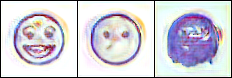

# Text-2-Sticker

A latent diffusion model trained from scratch to generate 128x128 messaging stickers from short text prompts. Built as a master's dissertation project at the University of Bucharest.

The model follows the standard latent diffusion recipe: a VAE compresses sticker images into a compact 4x32x32 latent space, a frozen CLIP text encoder provides token-level conditioning, and a U-Net denoiser learns to reverse the noise process in that latent space. At inference, classifier-free guidance and fast samplers (DPM-Solver, Euler) produce usable stickers in a few dozen steps.

## Results

The model handles simple, single-subject prompts well. "Happy cat", "sad panda", "woman with eyeglasses" tend to produce clean stickers with bold outlines, flat fills, and white backgrounds. Compositional prompts with multiple attributes degrade, which is expected given the dataset scale and the shallow U-Net.



## Architecture

Three components, each trained or loaded separately:

**VAE** -- Maps 128x128 RGB stickers to 4x32x32 latents and back. Trained first on images only with MSE + KL loss. Running diffusion in this latent is about 12x cheaper than pixel space, which matters a lot for a 128px target.

**Text encoder** -- CLIP ViT-L/14 loaded from `openai/clip-vit-large-patch14`, kept frozen during diffusion training. Produces 77x768 per-token states that feed into the U-Net via cross-attention.

**U-Net denoiser** -- Two downsample stages (32x32 -> 16x16 -> 8x8), a bottleneck, and a symmetric decoder with skip connections. Residual blocks get timestep embeddings via FiLM-style addition. Attention blocks do self-attention over spatial tokens then cross-attention against the text context. Trained with plain MSE noise-prediction loss.

## Dataset

About 58,000 stickers scraped from a public Telegram sticker index. After filtering out photos and anything without a mostly-white background, around 50,000 remained. These were automatically captioned using LLaVA 1.5 13B with the prompt:

> "Describe this sticker in one short sentence, focusing on the character's appearance, emotion, and action."

The result is a JSON manifest where each entry has a UUID, image filename, and caption. A `blacklist.txt` file allows excluding specific items without touching the manifest.

The dataset is not included in this repo.

## Project Structure

```
src/
    encoder.py       VAE encoder
    decoder.py       VAE decoder
    diffusion.py     U-Net denoiser
    ddpm.py          custom DDPM sampler used during training
    clip.py          small custom CLIP-style text encoder (early experiments)
    attention.py     attention blocks
    pipeline.py      inference pipeline helper

training/
    training.py      diffusion training loop
    training_vae.py  VAE training loop

utils/
    dataset.py       StickerDataset and EmojiDataset PyTorch datasets
    sample_diffusion.py   sampling script
    visualisation.py      logging helpers
    utils.py         checkpoint save/load, scheduler creation, metrics
    tokenizer/       CLIP BPE vocab and merges files

scripts/
    train.sh         launch diffusion training
    train_vae.sh     launch VAE training
    sample.sh        run inference on a list of prompts

notebooks/
    main.ipynb       exploration and evaluation notebook
    vae.ipynb        VAE inspection notebook

data/
    tokenizer/       vocab.json, merges.txt
    sticker_dataset_128x128/   images/, dataset.json, blacklist.txt (not tracked)
```

## Setup

```bash
pip install -r requirements.txt
```

The tokenizer files (`data/tokenizer/vocab.json` and `data/tokenizer/merges.txt`) need to be present. These are the standard CLIP BPE files from `openai/clip-vit-large-patch14`.

A CUDA GPU is expected. The Dockerfile is based on `rocm/pytorch` but the training scripts use standard CUDA PyTorch.

## Training

**Step 1: train the VAE**

```bash
bash scripts/train_vae.sh
```

This trains only the encoder and decoder on sticker images. Checkpoints are saved under `checkpoints/vae/`.

**Step 2: train the diffusion model**

```bash
bash scripts/train.sh
```

Loads a VAE checkpoint, freezes it, and trains the U-Net with CLIP text conditioning. Checkpoints are saved under `checkpoints/diffusion/`. Training took about 20 hours on two RTX 5090s.

Key arguments in `training/training.py`:

| argument | default | description |
|---|---|---|
| `--model_name` | `diffusion-1.0` | name used for checkpoint and log paths |
| `--vae_ckpt` | | path to a pretrained VAE checkpoint |
| `--freeze_vae` | | freeze VAE weights during diffusion training |
| `--epochs` | 10 | number of training epochs |
| `--batch_size` | 8 | batch size |
| `--lr` | 1e-4 | learning rate |
| `--lr_scheduler` | `constant` | one of `cosine`, `linear`, `constant` |
| `--num_train_steps` | 1000 | diffusion timesteps |
| `--num_infer_steps` | 50 | steps used for sample logging |
| `--augment` | | enable horizontal flip and small rotations |
| `--log_samples` | | save sample grids every 10 epochs |
| `--resume` | | resume from `--diffusion_ckpt` |

## Sampling

```bash
bash scripts/sample.sh
```

Or directly:

```bash
python utils/sample_diffusion.py \
    --ckpt checkpoints/diffusion/diffusion-1.0/epoch_0140.pth \
    --prompts "happy cat" "sad panda" "woman with eyeglasses" \
    --gscale 3.0 \
    --steps 40 \
    --out samples/output.png
```

The script uses `DPMSolverMultistepScheduler` by default. `EulerDiscreteScheduler` is also imported and can be swapped in for faster previews. Guidance scale around 3-5 works well; higher values sharpen the prompt match but reduce variety.

## Scheduler notes

Three samplers were tested:

- Custom DDPM sampler (used during training, stochastic, slow)
- `EulerDiscreteScheduler` (fast, good for previews)
- `DPMSolverMultistepScheduler` (best quality-per-step, used for final samples)

All three share the same noise schedule: `beta_start=0.00085`, `beta_end=0.012`, `scaled_linear`, 1000 training steps. Switching samplers requires only changing the scheduler object; the U-Net and guidance logic are the same.

## Limitations

- Attribute binding breaks down with more than two or three descriptors in a prompt.
- Fine details like fingers, text, and small accessories are unreliable at 128px.
- The white background heuristic used for filtering is imperfect and lets some textured backgrounds through.
- Auto-captions from LLaVA occasionally drift from the actual image content, which hurts prompt alignment.
- No v-prediction, no EDM preconditioning, no perceptual loss. The training objective is plain noise MSE.
